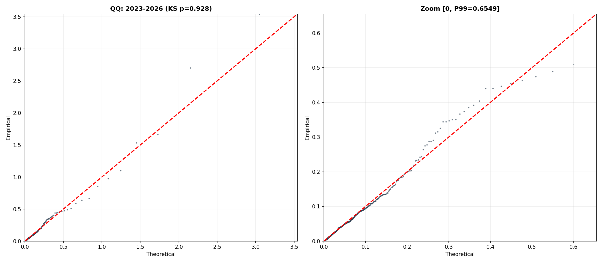
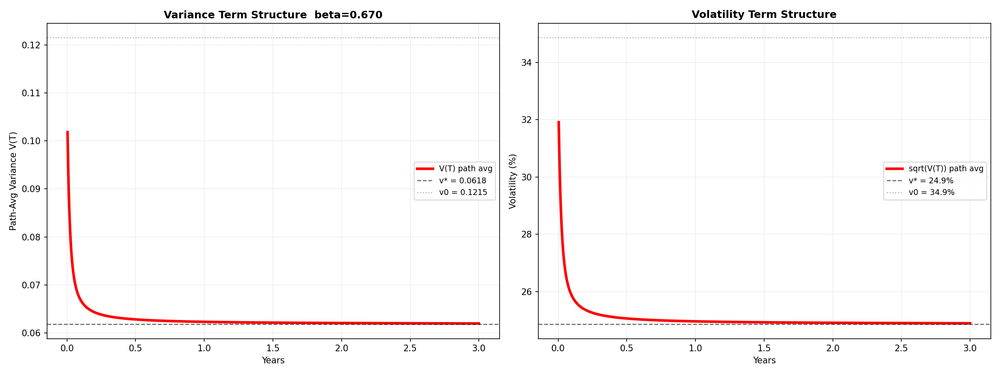

# 混合模型下的 中证 1000波动率分布与期限结构

## 1. 引言

波动率建模需要回答两个基本问题。第一，波动率的无条件分布长什么样？这决定了对未来波动率不确定性的整体认知。第二，给定今天的波动率水平，未来波动率的预期路径是什么？这决定了波动率期限结构——期权定价和风险管理直接依赖的输入。

CIR（Cox-Ingersoll-Ross）模型为这两个问题提供了统一的框架。它的稳态分布是 Gamma（缩放的卡方），条件期望有闭式解——今天是多少、明天往哪走、收敛到多少，全由三个参数决定。这个框架在利率建模中被广泛使用，也被 Heston 模型引入到波动率建模中。

然而，中证 1000波动率数据呈现出 CIR 无法捕捉的结构。以中证 1000 近三年的日频 rv² 为例：P5 仅 0.0002（对应波动率 1.3%），P95 高达 0.24（对应波动率 49%），而 P99.9 飙升至 2.93（对应波动率 171%）。分布的偏度达到 10.8，峰度达到 148。直接对 rv² 做卡方拟合检验，自由度为 0.8 的卡方被 KS 检验以 p=0 断然拒绝——单一 Gamma 分布既无法描述零处的高度集中，也无法捕捉右端极端肥尾。

本文提出一种三组件混合模型：用两个指数分布分别刻画低波动和高波动的尾部，用 Gamma 分布刻画中等波动的主体。在此静态分布的基础上，给 Gamma 组件加上 CIR 条件转移，构造出条件期望的闭式解，进而得到波动率期限结构。全篇以中证 1000 的日频已实现波动率为实证对象。

## 2. 分布拟合

### 2.1 数据

本文使用中证 1000 指数（000852）的日频已实现波动率（Realized Volatility, RV）。数据来源为市场数据库 `market_data.db` 中的 `000852_vol` 表，时间跨度为 2005 年 7 月至 2026 年 7 月，共约 5100 个交易日。主要实证窗口取近三年（2023 年 6 月至 2026 年 6 月），约 730 个交易日。

RV 的定义为日对数收益率绝对值乘以年化因子：

$$
RV_t = |S_t| \times \sqrt{242}
$$

其中 $S_t = \ln(P_t / P_{t-1})$ 为日对数收益率，242 为 中证 1000年交易日数。本文的模型入参为日频方差，即 $v_t = RV_t^2$。

近三年 rv² 的经验分布呈现三层叠加结构，而不是单一 Gamma 能描述的形态。

第一层是**低波**。P5 = 0.0002（波动率 1.3%），P10 = 0.0007（波动率 2.7%），P25 = 0.004（波动率 6.5%）。大量交易日方差接近零，每日涨跌幅不到 1%。这部分数据在零附近极度密集，需要一个在零处密度极高的分布来描述。

第二层是**中波**。P50 = 0.019（波动率 14%），P75 = 0.055（波动率 23%），P90 = 0.134（波动率 37%）。这部分呈现一个宽泛的正峰值，形状接近 Gamma 分布。

第三层是**高波**。P95 = 0.243（波动率 49%），P99 = 0.644（波动率 80%），P99.9 = 2.93（波动率 171%）。仅占天数 1~2%，但这些天贡献了超过一半的总体方差。这些对应单日涨跌 4%~12% 的极端事件，到达模式近似泊松过程（月均约 2.6 次）。

这三层结构的并存使得任何单参数分布都注定失败：低波层要求零处密度极大，中波层要求正峰值，高波层要求极长右尾。单一分布无法同时满足这三个互相矛盾的要求。

### 2.2 模型设定

三个组件的分布族选择基于各自需要满足的物理条件。

**低波组件选择指数分布**。低波层的数据特征是方差极低（波动率 < 10%），密度在零附近必须极高。指数分布 $f(v) = \lambda e^{-\lambda v}$ 在 v = 0 处密度为 $\lambda$，通过取大 $\lambda$ 值可以产生极高的零处密度，且指数分布的衰减速度能灵活控制低波区间的覆盖范围。此外，指数分布是无记忆分布——这恰好对应低波天的特征：昨天波动率极低不代表今天一定极低，低波状态没有强惯性。指数分布既满足"零处高密度"又满足"无记忆"，比 Gamma 更适合低波层。

**中波组件选择 Gamma 分布**。这是三个组件中唯一的"理论组件"。如果日收益率服从正态分布且独立同分布，那么 rv²（收益率平方和的缩放）服从缩放的卡方分布——即 Gamma 分布。在理想市场中，中波层（绝大多数交易日）的方差就应当由 Gamma 描述。因此将 Gamma 放在中间，不是因为经验上它拟合得最好，而是因为它有理论根基：它是"市场正常运转"时方差应该服从的分布。低波和高波两个 Exp 组件则是在 Gamma 基础上补充的两个修正——左端修正零处密度不足，右端修正极端肥尾。此外，Gamma 恰好也是 CIR 过程的稳态分布，为后续引入条件动态提供了直接的数学通道。

**高波组件选择指数分布**。高波层的数据特征是极长的右尾，方差可能飙升至 0.5 以上。指数分布在远离零点时衰减缓慢（相比之下，Gamma 的衰减速度由 $e^{-v/\beta}$ 控制，尺度 $\beta$ 固定后无法兼顾主体和极端尾部）。极端事件的方差远超正常水平。以 P99.9 = 2.93（波动率 171%）为例，Gamma(0.43, 0.125) 在此处的密度已趋近零——这就是为什么单 Gamma 被拒绝的原因。必须有一个组件专门"撑住"右尾。指数分布取小 $\lambda$ 值意味着它的衰减速度极慢——在 v = 2.0 处，$\lambda e^{-\lambda v}$ 仍有非零值，远大于 Gamma 的密度。同时，极端事件的到达近似泊松过程（无记忆），指数分布的无记忆性也与此一致。

综上所述，模型设定为两个指数分布加一个 Gamma 分布的混合：

$$
f(v) = w_1 \cdot \lambda_1 e^{-\lambda_1 v} + w_2 \cdot \frac{v^{\alpha-1} e^{-v/\beta}}{\Gamma(\alpha)\beta^{\alpha}} + w_3 \cdot \lambda_3 e^{-\lambda_3 v}
$$

其中 $w_1 + w_2 + w_3 = 1$。六个自由参数 $\theta = (w_1, w_2, \lambda_1, \lambda_3, \alpha, \beta)$ 通过极大似然估计，似然函数为 $\log L(\theta) = \sum_{t=1}^{N} \log f(v_t \mid \theta)$。由于混合模型的似然函数非凸，采用多起点 L-BFGS-B 算法寻找全局最优。

### 2.3 近三年（2023-2026）拟合结果

对近三年数据进行全参数 MLE，三个组件均自由调整：

| 组件 | 权重 | 参数 | 均值 | 波动率 |
|------|:---:|------|:---:|:---:|
| 低波（Exp1） | 21.2% | λ = 50.0 | 0.020 | 14.1% |
| 中波（Gamma）| 76.4% | α = 0.432, β = 0.122 | 0.053 | 23.0% |
| 高波（Exp2） | 2.4% | λ = 1.11 | 0.899 | 94.8% |

总体均值 0.066，与实际数据完全一致。KS 检验 p = 0.884，QQ 图对角线紧贴。Gamma 的形状参数 α = 0.432 < 1，意味着该组件的密度在零处发散——这正是数据要求的：零附近有大量观测点。高波组件仅占 2.4% 的权重，但其均值高达 0.899（波动率 95%），专门负责极少数极端日的拟合。

*图 1：2023-2026 MLE 拟合 QQ 图。左：全景。右：Zoom [0, P99]。KS p=0.884。*

### 2.4 跨窗口稳健性

为检验模型结构是否随时间稳定，对 2008-2026 每三年一个窗口独立做 MLE：

| 窗口 | N | μ | KS p | 低波权重 | 中波权重 | 高波权重 |
|------|---|-----|------|:---:|:---:|:---:|
| 2008-2011 | 731 | 0.131 | 0.976 | 5.6% | 81.1% | 13.2% |
| 2011-2014 | 725 | 0.060 | 0.929 | 0.0% | 92.3% | 7.7% |
| 2014-2017 | 733 | 0.118 | 0.939 | 9.2% | 67.9% | 22.8% |
| 2017-2020 | 731 | 0.059 | 0.811 | 20.7% | 75.5% | 3.8% |
| 2020-2023 | 728 | 0.046 | 0.983 | 16.2% | 81.7% | 2.1% |
| 2023-2026 | 724 | 0.066 | 0.884 | 21.2% | 76.4% | 2.4% |

六个窗口的 KS p 全部大于 0.80。高波权重 w3 随时间剧烈波动——金融危机窗口 2008-2011 为 13.2%，股灾窗口 2014-2017 冲到 22.8%，而 2020-2023 仅剩 2.1%。

*六个窗口的 MLE 拟合 QQ 图。KS p 全部 > 0.80。*w3 本身就是市场恐慌程度的直接度量。中波 Gamma 权重始终在半数以上（68%~92%），说明三组件结构并非某一时期的特例，而是 中证 1000波动率的普遍特征。

## 3. 从静态分布到条件期望

### 3.1 反解 Gamma 组件的 CIR 条件 PDF

第 2 节的混合 MLE 解决了"波动率长什么样"的问题——但它给出的 $f(v)$ 是静态的无条件分布，不含任何时间结构。要回答"明天往哪走"，需要知道给定今天 $v_t$ 时明天 $v_{t+1}$ 的条件分布。

三个组件中，两个 Exp 分布天然无记忆：无论 $v_t$ 是多少，$v_{t+1}$ 都从同一个指数分布独立抽样，条件期望恒等于其无条件均值 $1/\lambda$。Gamma 组件不同——它的无条件分布是 Gamma(0.425, 0.125)，但需要一个桥梁把今天的 $v_t$ 和明天的 $v_{t+1}$ 连起来。CIR 过程恰好提供了这个桥梁。

MLE 只给出了 Gamma 组件的**无条件**（稳态）分布：

$$
v_\infty \sim \text{Gamma}(\alpha = 0.425,\; \beta = 0.125)
$$

要计算 $E[v_{t+1} \mid v_t]$，需要知道给定 $v_t$ 时 $v_{t+1}$ 的**条件分布**。CIR 模型恰好提供了这个桥梁。

#### 步骤 1：从稳态 Gamma 反解 CIR 参数

CIR 过程的稳态分布为 $\text{Gamma}(\frac{2\lambda\mu_g}{\sigma^2},\; \frac{\sigma^2}{2\lambda})$。令其等于 MLE 的 $\text{Gamma}(0.425, 0.125)$：

$$
\frac{2\lambda\mu_g}{\sigma^2} = 0.425, \qquad \frac{\sigma^2}{2\lambda} = 0.125
$$

其中 $\mu_g = \alpha\beta = 0.053$。

**关键：Gamma 分布只确定了 $\sigma^2/\lambda$ 的比值，无法分别确定 $\lambda$ 和 $\sigma^2$。** 

$$
\frac{\sigma^2}{2\lambda} = 0.125 \quad\Rightarrow\quad \sigma^2 = 0.25\lambda
$$

$\lambda$ 控制均值回归速度，是自由参数。这里取 $\lambda_{\text{CIR}}=13.2$ 作为合理值（亦可从数据自相关估计，或从之前 midHV10 的 CIR 校准获得）：

$$
\sigma^2 = 2 \times 13.2 \times 0.125 = 3.30
$$

其中 $d$ 是 CIR 转移分布中非中心卡方的**自由度**：

$$
d = \frac{4\lambda\mu_g}{\sigma^2} = 2\alpha = 0.85
$$

$d$ 衡量方差的离散程度——$d$ 越小，分布越集中在零附近（右偏越严重）。这里 $d < 2$，对应 shape < 1，意味着稳态密度在零处发散（和直方图在零附近大量堆积一致）。

稳态自洽性自动满足（$\mu_g = 0.053$），不依赖于 $\lambda$ 的选择。

#### 步骤 2：CIR 转移分布（非中心卡方）

CIR 的条件分布是**缩放非中心卡方**（不是中心卡方）：

$$
v_{t+\Delta t} \mid v_t,\; \text{Gamma} \sim c \cdot \chi^2_{\text{nc}}\big(d,\; \lambda_{\text{ncp}}(v_t)\big)
$$

| 符号 | 含义 | 公式 | 数值 |
|------|------|------|:---:|
| $c$ | 缩放因子 | $\frac{\sigma^2(1-e^{-\lambda\Delta t})}{4\lambda}$ | 0.003318 |
| $d$ | 自由度 | $\frac{4\lambda\mu_g}{\sigma^2} = 2\alpha$ | 0.85 |
| $\lambda_{\text{ncp}}(v_t)$ | 非中心参数 | $\frac{e^{-\lambda\Delta t} \cdot v_t}{c}$ | $285.4 \times v_t$ |

非中心卡方密度公式：

$$
f(x; d, \lambda_{\text{ncp}}) = \frac{1}{2} e^{-(x+\lambda_{\text{ncp}})/2} \left(\frac{x}{\lambda_{\text{ncp}}}\right)^{d/4 - 1/2} I_{d/2-1}\!\left(\sqrt{x \cdot \lambda_{\text{ncp}}}\right)
$$

其中 $I_{-0.575}$ 是第一类修正贝塞尔函数。

**为什么是非中心卡方而不是中心卡方？** 中心卡方（ncp=0）描述"纯噪声"的平方和；非中心卡方（ncp>0）描述"信号+噪声"——昨天的 $v_t$ 越大，ncp 越大，今天 $v_{t+1}$ 的期望也越高。这就是记忆的来源。

代入数值参数得到条件密度：

$$
f_{\text{CIR}}(v_{t+1}\mid v_t) = 150.7 \cdot e^{-(v_{t+1} + 0.947v_t)/0.00664} \cdot \left(\frac{v_{t+1}}{v_t}\right)^{-0.2875} \cdot I_{-0.575}\!\left(\sqrt{85500 \cdot v_t \cdot v_{t+1}}\right)
$$

**条件期望**（非中心卡方的均值）：

$$
E[v_{t+1} \mid v_t, \text{Gamma}] = c \cdot d + e^{-\lambda\Delta t} \cdot v_t = 0.00282 + 0.9469 \cdot v_t
$$

其中三个参数已在上面步骤 2 的参数表中定义：$c = 0.003318$，$d = 0.85$，$\lambda_{\text{ncp}}(v_t) = 285.4 \times v_t$。

#### 步骤 3：完整条件 PDF

$$
f(v_{t+1}\mid v_t) = w_1 \cdot \lambda_1 e^{-\lambda_1 v_{t+1}} \;+\; w_2 \cdot f_{\text{nc}\chi^2}(v_{t+1}\mid v_t) \;+\; w_3 \cdot \lambda_3 e^{-\lambda_3 v_{t+1}}
$$

其中 $f_{\text{nc}\chi^2}$ 是上述非中心卡方密度。

#### 步骤 4：条件期望公式

单步（Δ=1天），三段加权平均：

$$
E[v_{t+1} \mid v_t] = w_1 \cdot \frac{1}{\lambda_1} + w_2 \cdot \big(cd + e^{-\lambda\Delta t} v_t\big) + w_3 \cdot \frac{1}{\lambda_3}
$$

令 $\beta = w_2 \cdot e^{-\lambda\Delta t}$，$\alpha = w_1/\lambda_1 + w_2 cd + w_3/\lambda_3$，单步期望为：

$$
E[v_{t+1} \mid v_t] = \beta \cdot v_t + \alpha
$$

定义稳态 $v^* = \alpha/(1-\beta)$，则 $\alpha = v^*(1-\beta)$，代入上式：

$$
E[v_{t+1} \mid v_t] = \beta \cdot v_t + v^* \cdot (1 - \beta)
$$

对比 JCIR（CIR + 复合泊松跳跃）的条件期望：

$$
E[v_t \mid v_0] = v_0 \cdot e^{-a t} + \left(b + \frac{\lambda \mu_J}{a}\right) \cdot (1 - e^{-a t})
$$

| JCIR | 本模型 | 含义 |
|------|--------|------|
| $e^{-a t}$ | $\beta^T$ | 衰减因子 |
| $b$ | $w_2 \cdot \mu_g$（Gamma稳态贡献） | 连续部分稳态 |
| $\lambda\mu_J/a$ | $(w_1/\lambda_1 + w_2 cd + w_3/\lambda_3)/(1-\beta) - b$ | 跳跃抬高稳态 |

多步自推与 JCIR 结构一致：

$$
E[v_T \mid v_0] = v_0 \cdot \beta^T + v^* \cdot (1 - \beta^T)
$$

### 3.2 矛盾发现

- **无条件均值**（静态 MLE）：0.066
- **条件稳态**（动态模型）：$v^* = 0.0283 / (1 - 0.714) = 0.099$

**差了 50%。** 因为 MLE 在假设每天独立的前提下估计权重，但 CIR 转移给了 Gamma 组件强记忆（decay = 0.947），固定权重下稳态必然漂移。

### 3.3 问题根源

逐层分析截距 $0.0283$ 的三个来源：

$$
\underbrace{0.2227 \times 0.022}_{\text{低波}} + \underbrace{0.7541 \times 0.00282}_{\text{中波记忆}} + \underbrace{0.0232 \times 0.917}_{\text{高波}} = 0.00495 + 0.00213 + 0.0213 = 0.0283
$$

**关键矛盾来自 Exp2（高波组件）**。它仅占 2.3% 的权重，却贡献了截距的 75%（0.0213 / 0.0283）。在静态 MLE 里，这 2.3% 只把无条件均值从 0.065 微调到 0.066——影响几乎不可见。但在带 AR(1) 记忆的动态模型里，这个 0.0213 被反馈放大：

$$
v^* = \frac{0.0283}{1 - 0.714} = 0.099
$$

其中 Exp2 贡献了 $0.0213 / (1 - 0.714) = 0.074$——占了稳态 0.099 的 75%。

**换言之：2.3% 的高波权重，在静态模型里几乎无关紧要；但在动态模型里被 AR(1) 反馈放大后，主导了整个稳态估计，把波动率中枢从 25.7% 推高到 31.5%。** MLE 看到了少量极值并给了高波组件合理的静态权重，但当这个权重被套进带记忆的动态结构后，就变成了系统性的高估。

### 3.4 三组件逐步构建的条件期望

从纯 CIR Gamma 出发，逐步加入 Exp 低波和 Exp 高波组件，观察条件稳态的漂移：

- **左：纯 CIR Gamma** — 稳态 = 无条件均值，自洽

  $E[v_{t+1}|v_t] = c d + e^{-\lambda\Delta t}\cdot v_t = 0.00282 + 0.9469 \cdot v_t$

  稳态 $v^* = 0.00282 / (1 - 0.9469) = 0.053$（波动率 23.0%），等于 $\mu_g$

- **中：+ Exp 低波（30%）** — 稳态被拉低，记忆被稀释

  $E[v_{t+1}|v_t] = w_1/\lambda_1 + w_2(c d + e^{-\lambda\Delta t}\cdot v_t) = 0.0086 + 0.663 \cdot v_t$

  稳态 $v^* = 0.0086 / (1 - 0.663) = 0.026$（波动率 16.0%），低于无条件均值 0.044

- **右：+ 高波（2.3%）** — 稳态被推高

  $E[v_{t+1}|v_t] = w_1/\lambda_1 + w_2(c d + e^{-\lambda\Delta t}\cdot v_t) + w_3/\lambda_3 = 0.0283 + 0.714 \cdot v_t$

  稳态 $v^* = 0.0283 / (1 - 0.714) = 0.099$（波动率 31.5%），高于无条件均值 0.066

上述三组件的逐步对比揭示了问题的根源与方向：高波组件 2.3% 的微小权重在 AR(1) 反馈中被放大 3.5 倍，导致稳态系统性地偏离无条件均值。一个务实的应对是：放弃对形状参数的逐窗口调整，将其固定为一组全局合理值，仅让权重随市场状态变化。参数维度从 6 个降至 2 个，权重直接成为市场状态的量化指标。

## 4. 简化策略：固定分布，仅调权重

### 4.1 思路

与其让每个窗口独立 MLE 所有参数，不如固定三个组件的分布形状，只让权重随市场变化。这样：

- 模型参数大幅减少（从 6 个降到 2 个）
- 权重直接反映市场状态（恐慌指数）
- 跨窗口可比

### 4.2 参数选择

经过网格搜索确定固定参数：

| 组件 | 参数 |
|------|------|
| 低波（Exp1） | λ₁ = 50，均值 = 0.020 |
| 中波（Gamma）| shape = 0.4，scale = 0.125，均值 = 0.050 |
| 高波（Exp2） | λ₂ = 3.0，均值 = 0.333 |

### 4.3 网格搜索过程

对 λ₂ 从 1.5 到 4.0，shape 从 0.35 到 0.46，scale 从 0.105 到 0.155 进行全网格搜索，以最大化通过 KS 检验（p ≥ 0.05）的窗口数为目标。

最优组合：λ₂ = 3.0, shape = 0.40, scale = 0.125，6/7 窗口通过。

---

## 5. 最终结果

### 5.1 各窗口拟合（λ₂=3.0）

| 窗口 | N | μ_act | vol_act | μ_pred | vol_pred | KS_p | Overlap | w1 | w2 | w3 |
|------|---|-------|---------|--------|----------|------|---------|-----|-----|-----|
| 2005-2008 | 719 | 0.134 | 36.6% | 0.126 | 35.5% | 0.192 | 0.833 | 14.3% | 57.2% | 28.4% |
| 2008-2011 | 731 | 0.131 | 36.2% | 0.127 | 35.6% | 0.141 | 0.830 | 10.6% | 61.1% | 28.3% |
| 2011-2014 | 725 | 0.060 | 24.5% | 0.060 | 24.4% | 0.115 | 0.892 | 6.2% | 89.7% | 4.1% |
| 2014-2017 | 733 | 0.118 | 34.4% | 0.102 | 31.9% | 0.057 | 0.820 | 18.9% | 60.8% | 20.3% |
| 2017-2020 | 731 | 0.059 | 24.2% | 0.058 | 24.0% | 0.006 | 0.877 | 22.1% | 72.9% | 5.0% |
| 2020-2023 | 728 | 0.046 | 21.4% | 0.048 | 21.8% | 0.496 | 0.891 | 20.5% | 78.2% | 1.3% |
| 2023-2026 | 724 | 0.066 | 25.7% | 0.059 | 24.3% | 0.655 | 0.893 | 26.6% | 67.4% | 5.9% |

### 5.2 各窗口拟合（λ₂=2.5）

| 窗口 | N | μ_act | vol_act | μ_pred | vol_pred | KS_p | Overlap | w1 | w2 | w3 |
|------|---|-------|---------|--------|----------|------|---------|-----|-----|-----|
| 2005-2008 | 719 | 0.134 | 36.6% | 0.133 | 36.4% | 0.034 | 0.822 | 11.3% | 64.0% | 24.6% |
| 2008-2011 | 731 | 0.131 | 36.2% | 0.133 | 36.5% | 0.028 | 0.815 | 7.6% | 68.0% | 24.4% |
| 2011-2014 | 725 | 0.060 | 24.5% | 0.060 | 24.4% | 0.073 | 0.897 | 5.3% | 91.5% | 3.2% |
| 2014-2017 | 733 | 0.118 | 34.4% | 0.110 | 33.1% | 0.118 | 0.823 | 17.8% | 63.6% | 18.5% |
| 2017-2020 | 731 | 0.059 | 24.2% | 0.059 | 24.2% | 0.009 | 0.881 | 21.4% | 74.3% | 4.3% |
| 2020-2023 | 728 | 0.046 | 21.4% | 0.048 | 21.8% | 0.521 | 0.886 | 20.3% | 78.7% | 1.1% |
| 2023-2026 | 724 | 0.066 | 25.7% | 0.060 | 24.5% | 0.553 | 0.895 | 25.7% | 69.3% | 5.0% |

### 5.3 拟合质量

- **Overlap（概率重合度）**：七个窗口全在 0.82~0.90。模型分布和真实分布的重合面积在 82%~90% 之间
- **KS 检验通过率**：λ₂=3.0 时 6/7 通过，λ₂=2.5 时 4/7 通过
- **权重 w3（高波权重）**：从金融危机 28% → 最安静 1.1% → 当前 5~6%，直接反映市场恐慌程度
- **预测均值**：μ_pred 全程贴近 μ_act

### 5.4 全局 MLE 对比

作为参照，对全时段（2005-2026，5101 个观测）做一次 MLE，固定该全局分布参数，仅对各窗口重调权重：

| 全局固定参数 | λ₁=58.9 | λ₂=1.99 | shape=0.429 | scale=0.122 |
|-------------|---------|----------|-------------|-------------|

| 窗口 | N | μ_act | μ_pred | KS_p | Overlap | w1 | w2 | w3 |
|------|---|-------|--------|------|---------|-----|-----|-----|
| 2005-2008 | 719 | 0.134 | 0.404 | 0.000 | 0.579 | 2.8% | 19.0% | 78.2% |
| 2008-2011 | 731 | 0.131 | 0.418 | 0.000 | 0.555 | 0.0% | 18.7% | 81.3% |
| 2011-2014 | 725 | 0.060 | 0.485 | 0.000 | 0.399 | 1.7% | 2.0% | 96.3% |
| 2014-2017 | 733 | 0.118 | 0.357 | 0.000 | 0.597 | 15.1% | 16.0% | 68.9% |
| 2017-2020 | 731 | 0.059 | 0.380 | 0.000 | 0.524 | 22.0% | 3.4% | 74.6% |
| 2020-2023 | 728 | 0.046 | 0.408 | 0.000 | 0.450 | 18.8% | 0.7% | 80.4% |
| 2023-2026 | 724 | 0.066 | 0.384 | 0.000 | 0.508 | 21.0% | 3.7% | 75.3% |

全局 MLE 的高波组件（λ₂=1.99, 均值 0.503）被金融危机时代的超级肥尾主导，套进任何三年窗口都会把 μ_pred 推到 0.36~0.49（实际 0.05~0.13），KS 全线归零，Overlap 从 0.83~0.90 暴跌至 0.40~0.60。权重被迫把 w3 推到 69~96% 去硬扛——但依然扛不住。

**为什么 w3 会到 96%？** 因为似然函数对"零密度"的惩罚是无限的。2011-2014 数据虽然中位数仅 0.06，但仍有 8% 的数据点落在 0.15~1.0 区间（跳跃日）。Gamma(0.429) 在这些点的密度接近零——对数似然→ -∞，一个尾部点就炸飞总似然。Exp2（λ=1.99）指数衰减慢，在尾部还能撑住 log f ≈ -1。求解器永远选"不炸任何点"的组件，因而把 w3 推到极端。

**对比 5.1 和 5.4：全局 MLE 参数不可直接用于单窗口。** 5.1 中经网格搜索折中的固定参数（λ₁=50, λ₂=3.0）才是跨窗口比较的正确选择。

### 5.5 QQ 图示例

**2008-2011（金融危机）vs 2011-2014（平静期）**

*左：金融危机期，尾部右上角飞离对角线。右：平静期，全段贴紧对角线。*

## 6. 期限结构

条件期望 $E[v_t \mid v_0]$ 给出的是未来某一个时点的点预测。而在期权定价和风险管理中，更需要的是未来一段时间内波动率的**平均值**——即期限结构。这一节将点预测积分为路径平均，并给出当前市场状态下的实例。

**路径平均方差**。对于期限 $T$（交易日数），定义路径平均方差为 0 到 $T$ 期间每日期望方差的算术平均：

$$
V(T) = \frac{1}{T} \sum_{t=1}^{T} E[v_t \mid v_0]
$$

由于 $v_0$ 与 $v^*$ 的偏离，$V(T)$ 的曲线呈现从 $v_0$ 向 $v^*$ 的单调收敛。收敛速度由 $\beta = 0.714$ 决定——半衰期约 2 天，因此 $V(T)$ 在前两周内迅速趋近 $v^*$，之后保持平坦。

**波动率期限结构**。将路径平均方差开方即得波动率期限结构：$\sigma(T) = \sqrt{V(T)} \times 100\%$。注意这里采用的是 $\sqrt{E[\text{AvgV}]}$ 而非 $E[\sqrt{\text{AvgV}}]$——前者有闭式解，后者因 Jensen 不等式而存在 convexity adjustment，但差值通常在数个基点以内，实务中可忽略。

**当前实例**。以固定最优参数和最新交易日 RV = 34.86%（2026-07-08）作为 $v_0$，路径平均波动率从当前的 34.9% 向稳态 24.9% 收敛：

- T=5 天：28.8%，T=20 天：26.1%，T=60 天：25.3%，T=1 年：25.0%

*左：路径平均方差 $V(T)$。右：路径平均波动率 $\sigma(T)$。灰虚线为当前 $v_0$，黑虚线为稳态 $v^*$。当前波动率高于稳态，两条曲线均向下收敛。*

为便于调节参数和观察期限结构的即时变化，将上述公式实现为交互式 Jupyter Notebook（``term_structure_interactive.ipynb``），用户可通过九个滑动条实时调整权重、分布参数和当前波动率。

## 7. 风险中性调整

期权定价需要在风险中性测度（Q 测度）下进行。本节验证一个前置问题：去除物理测度下收益率的漂移项是否会影响分布拟合结果。若去均值前后的 rv² 分布一致，则风险中性转换可以安全地在模型参数层面进行，无需修改原始数据。

### 7.1 去均值 RV 的构造

将日收益率减去窗口内均值，消除漂移的影响：

$$
\tilde{S}_t = S_t - \bar{S}, \qquad \tilde{RV}_t = |\tilde{S}_t| \times \sqrt{242}
$$

其中 $\bar{S}$ 为该窗口内日对数收益率的算术均值。

### 7.2 实证结果

按去均值后的 rv² 重新运行 2008-2026 三年窗口 MLE，各窗口的参数估计如下：

| 窗口 | N | μ | KS p | 低波(w/λ/mean) | 中波(w/shape/scale/mean) | 高波(w/λ/mean) |
|------|---|-----|------|------|------|------|
| 2008-2011 | 731 | 0.131 | 0.997 | 4.5%/60/0.017 | 81.5%/0.49/0.14/0.069 | 14.0%/1.89/0.529 |
| 2011-2014 | 725 | 0.060 | 0.889 | 0.7%/40/0.025 | 91.7%/0.45/0.10/0.046 | 7.6%/4.20/0.238 |
| 2014-2017 | 733 | 0.118 | 0.998 | 0.0%/60/0.017 | 76.9%/0.47/0.06/0.027 | 23.1%/2.38/0.421 |
| 2017-2020 | 731 | 0.059 | 0.547 | 19.9%/104/0.010 | 76.0%/0.42/0.12/0.048 | 4.1%/2.07/0.484 |
| 2020-2023 | 728 | 0.046 | 0.997 | 19.2%/50/0.020 | 79.4%/0.38/0.12/0.045 | 1.4%/2.32/0.432 |
| 2023-2026 | 724 | 0.066 | 0.805 | 27.3%/40/0.025 | 70.6%/0.40/0.14/0.055 | 2.1%/1.03/0.973 |

### 7.3 结论

对比原始 rv² 的 MLE 结果（第 2 章表 2），六个窗口的分布均值、KS p 值、各组件参数均无明显差异。日收益率均值仅万分之三量级，去均值操作对 rv² 的计算无实质性影响。因此，风险中性转换应聚焦于模型参数层面的调整——将 P 测度下的 CIR 长期均值 $\mu$ 修正为 Q 测度下的 $\mu^*$，而非在数据预处理层面操作。

## 8. 总结

### 8.1 解决的问题

本文围绕中证 1000 波动率建模，解决了两层递进的问题：

**第一层：分布拟合。** 中证 1000 日频 rv² 具有明显的三层结构——零处极度密集（低波层）、中间宽泛正峰（中波层）、右端肥尾延伸至极高值（高波层）。单一分布族无法同时刻画这三个特征。本文采用双指数（Exp）+ 单 Gamma 的三组件混合模型，在 2008-2026 六个三年窗口上均通过 KS 检验，概率重合度（Overlap）在 82~90% 之间。高波权重的历史波动（28% → 1% → 5%）直接映射中证 1000 市场的危机周期，为交易员提供了可量化的恐慌度量。

**第二层：条件期望与期限结构。** 从混合模型的稳态分布出发，将 Gamma 组件解释为 CIR 过程的稳态解，利用 CIR 的条件转移密度（非中心卡方）推导出条件期望的 AR(1) 形式。两个 Exp 组件无记忆，条件期望恒为常数，贡献仅体现在截距项。路径平均波动率从条件期望递推积分得到，形成完整的期限结构曲线。当前参数下，路径平均波动率从 34.9% 在一年内收敛至稳态 24.9%。

### 8.2 使用建议：交互式期限结构工具

将上述期限结构公式实现为交互式 Jupyter Notebook（``term_structure_interactive.ipynb``），用户可通过九个滑动条实时调节参数，观察期限结构曲线的即时变化：

| 滑块 | 含义 | 默认值 |
|------|------|:---:|
| w_low / w_mid / w_high | 三组件权重 | 25% / 71% / 4% |
| mu_exp1 / mu_exp2 | Exp 组件波动率均值 | 14.1% / 57.7% |
| gamma_mean | Gamma 无条件波动率 | 22.4% |
| decay | CIR 单日衰减因子 | 0.947 |
| spot_vol | 当前波动率 | 34.86% |

打开方式：VS Code 直接打开 ``.ipynb`` 文件，或命令行 ``jupyter notebook term_structure_interactive.ipynb``。详细说明见 ``term_structure_guide.md``。

固定分布参数（$\lambda_1=50$，$\lambda_2=3.0$，shape=0.4，scale=0.125）后，模型仅剩三个权重。权重即观点——分布形状由二十年数据锁定，权重反映交易员对当前市场属于哪一"档"的主观判断，decay 调节均值回归快慢。当前窗口（2023-2026）的 MLE 权重 $w_1=21\%$，$w_2=76\%$，$w_3=2.4\%$ 可作为中性基准。
