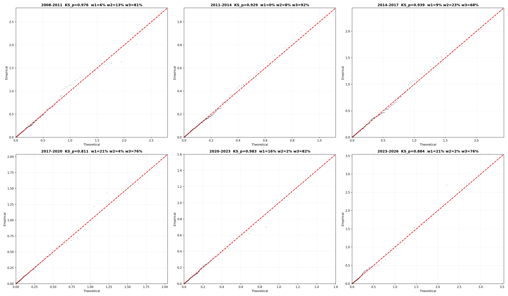
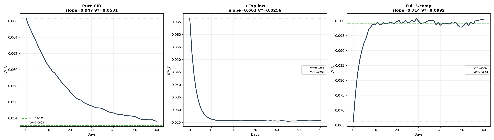
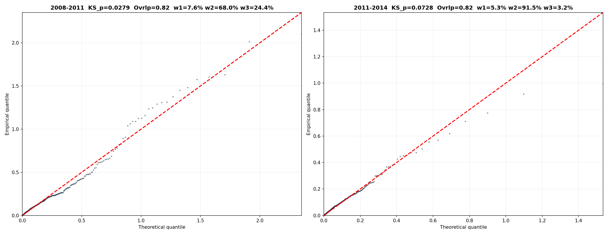
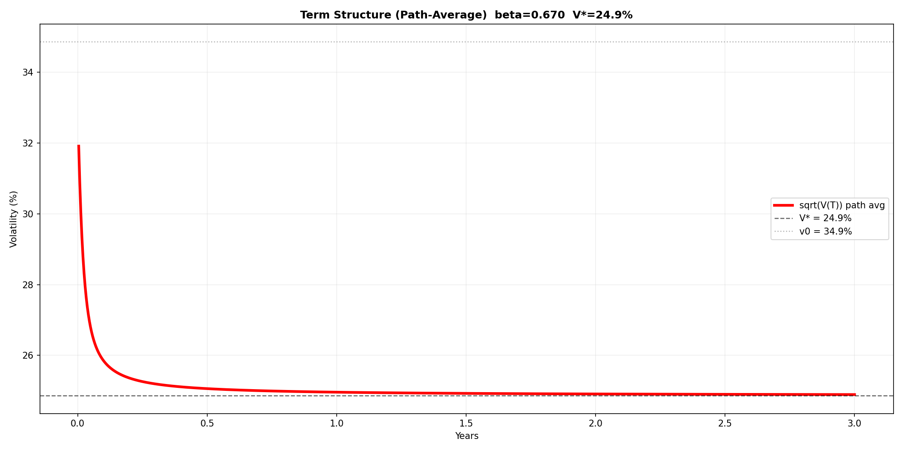

CIR 混合模型：从分布拟合到期限结构
======================================

1. 动机：拟合 rv 方差的分布
---------------------------

1.1 初始发现
^^^^^^^^^^^^

从 000852 的日频 rv² 入手，观测其经验分布：

- 大量日期方差较小（P50 = 0.019，对应波动率 13.9%）
- 少数日期方差极大（P99.9 = 2.93，对应波动率 171%）
- 偏度 10.8，峰度 148——极端的右偏和肥尾

对 rv² 进行卡方拟合检验：最佳拟合卡方自由度 d = 0.8，KS p = 0.000——强烈拒绝。**rv² 不服从卡方分布。**

1.2 分布的三层结构
^^^^^^^^^^^^^^^^^^

进一步分析发现，rv² 的经验分布呈现三种特征叠加：

- **第一层：低波** — 大量交易日方差几乎为零（P10 对应波动率 2.7%）
- **第二层：中波** — P50~P90 对应波动率 14%~37%，有正峰值
- **第三层：高波** — P99 对应波动率 80%，P99.9 对应 171%，这些对应单日涨跌 4%~12% 的极端事件

这表明 rv² 不能用单一分布描述，而应由三个组件混合而成。

2. 混合模型构建
---------------

2.1 三组件模型
^^^^^^^^^^^^^^

采用 2 个指数分布 + 1 个 Gamma 分布的混合：

.. math::

    f(v) = w_1 \cdot \lambda_1 e^{-\lambda_1 v} + w_2 \cdot \frac{v^{\alpha-1} e^{-v/\beta}}{\Gamma(\alpha)\beta^{\alpha}} + w_3 \cdot \lambda_3 e^{-\lambda_3 v}

- **低波（Exp1）**：:math:`\lambda_1` 大，均值小——抓接近零的低方差
- **中波（Gamma）**：:math:`\alpha, \beta` 灵活——抓中等方差
- **高波（Exp2）**：:math:`\lambda_3` 小，均值大——抓极右尾

2.2 MLE 估计
^^^^^^^^^^^^

通过极大似然估计（MLE）拟合参数，似然函数：

.. math::

    \log L(\theta) = \sum_{t=1}^{N} \log f(v_t \mid \theta)

由于没有解析解，采用多起点 L-BFGS-B 数值优化。

2.3 近三年（2023-2026）拟合结果
^^^^^^^^^^^^^^^^^^^^^^^^^^^^^^^

.. list-table::
   :header-rows: 1

   * - 组件
     - 权重
     - 参数
     - 均值
     - 对应波动率
   * - 低波（Exp1）
     - 22.3%
     - λ=45.0
     - 0.022
     - 14.9%
   * - 中波（Gamma）
     - 75.4%
     - α=0.425, β=0.125
     - 0.053
     - 23.0%
   * - 高波（Exp2）
     - 2.3%
     - λ=1.09
     - 0.917
     - 95.7%

总体均值 = 0.066，KS p = 0.065。QQ 图和 KS 检验均通过。

2.4 各窗口 MLE 拟合结果
^^^^^^^^^^^^^^^^^^^^^^^

对 2008-2026 每三年一个窗口独立 MLE，三个组件全部自由调参：

.. list-table::
   :header-rows: 1

   * - 窗口
     - N
     - μ
     - KS p
     - 低波(w/λ/mean)
     - 中波(w/shape/scale/mean)
     - 高波(w/λ/mean)
   * - 2008-2011
     - 731
     - 0.131
     - 0.976
     - 5.6%/39.9/0.025
     - 81.1%/0.465/0.158/0.073
     - 13.2%/1.88/0.532
   * - 2011-2014
     - 725
     - 0.060
     - 0.929
     - 0.0%/40.0/0.025
     - 92.3%/0.450/0.101/0.046
     - 7.7%/4.20/0.238
   * - 2014-2017
     - 733
     - 0.118
     - 0.939
     - 9.2%/40.0/0.025
     - 67.9%/0.413/0.071/0.029
     - 22.8%/2.38/0.420
   * - 2017-2020
     - 731
     - 0.059
     - 0.811
     - 20.7%/98.0/0.010
     - 75.5%/0.407/0.122/0.050
     - 3.8%/1.97/0.508
   * - 2020-2023
     - 728
     - 0.046
     - 0.983
     - 16.2%/50.0/0.020
     - 81.7%/0.398/0.107/0.043
     - 2.1%/2.73/0.366
   * - 2023-2026
     - 724
     - 0.066
     - 0.884
     - 21.2%/50.0/0.020
     - 76.4%/0.432/0.122/0.053
     - 2.4%/1.11/0.899

**QQ 图**

*六个窗口的 MLE 拟合 QQ 图。KS p 全部 > 0.80。*

3. 从静态分布到条件期望
-----------------------

3.1 反解 Gamma 组件的 CIR 条件 PDF
^^^^^^^^^^^^^^^^^^^^^^^^^^^^^^^^^^

MLE 只给出了 Gamma 组件的无条件（稳态）分布：

.. math::

    v_\infty \sim \text{Gamma}(\alpha = 0.425,\; \beta = 0.125)

要计算 :math:`E[v_{t+1} \mid v_t]`，需要知道给定 :math:`v_t` 时 :math:`v_{t+1}` 的条件分布。CIR 模型恰好提供了这个桥梁。

**步骤 1：从稳态 Gamma 反解 CIR 参数**

CIR 过程的稳态分布为 :math:`\text{Gamma}(2\lambda\mu_g/\sigma^2,\; \sigma^2/(2\lambda))`。令其等于 MLE 的 Gamma(0.425, 0.125)：

.. math::

    \frac{2\lambda\mu_g}{\sigma^2} = 0.425, \qquad \frac{\sigma^2}{2\lambda} = 0.125

其中 :math:`\mu_g = \alpha\beta = 0.053`。Gamma 分布只确定了 :math:`\sigma^2/\lambda` 的比值，:math:`\lambda` 是自由参数（取 :math:`\lambda_{\text{CIR}}=13.2`）：

.. math::

    \sigma^2 = 2 \times 13.2 \times 0.125 = 3.30

:math:`d` 是 CIR 转移分布中非中心卡方的自由度：

.. math::

    d = \frac{4\lambda\mu_g}{\sigma^2} = 2\alpha = 0.85

**步骤 2：CIR 转移分布（非中心卡方）**

CIR 的条件分布是**缩放非中心卡方**（不是中心卡方）：

.. math::

    v_{t+\Delta t} \mid v_t,\; \text{Gamma} \sim c \cdot \chi^2_{\text{nc}}\big(d,\; \lambda_{\text{ncp}}(v_t)\big)

.. list-table::
   :header-rows: 1

   * - 符号
     - 含义
     - 公式
     - 数值
   * - :math:`c`
     - 缩放因子
     - :math:`\sigma^2(1-e^{-\lambda\Delta t})/(4\lambda)`
     - 0.003318
   * - :math:`d`
     - 自由度
     - :math:`4\lambda\mu_g/\sigma^2 = 2\alpha`
     - 0.85
   * - :math:`\lambda_{\text{ncp}}(v_t)`
     - 非中心参数
     - :math:`e^{-\lambda\Delta t} \cdot v_t / c`
     - :math:`285.4 \times v_t`

非中心卡方密度公式：

.. math::

    f(x; d, \lambda_{\text{ncp}}) = \frac{1}{2} e^{-(x+\lambda_{\text{ncp}})/2} \left(\frac{x}{\lambda_{\text{ncp}}}\right)^{d/4 - 1/2} I_{d/2-1}\!\left(\sqrt{x \cdot \lambda_{\text{ncp}}}\right)

其中 :math:`I_{-0.575}` 是第一类修正贝塞尔函数。

**步骤 3：完整条件 PDF**

.. math::

    f(v_{t+1}\mid v_t) = w_1 \cdot \lambda_1 e^{-\lambda_1 v_{t+1}} + w_2 \cdot f_{\text{nc}\chi^2}(v_{t+1}\mid v_t) + w_3 \cdot \lambda_3 e^{-\lambda_3 v_{t+1}}

**步骤 4：条件期望公式**

单步（Δ=1天），三段加权平均：

.. math::

    E[v_{t+1} \mid v_t] = w_1 \cdot \frac{1}{\lambda_1} + w_2 \cdot \big(cd + e^{-\lambda\Delta t} v_t\big) + w_3 \cdot \frac{1}{\lambda_3}

令 :math:`\beta = w_2 \cdot e^{-\lambda\Delta t}`，:math:`\alpha = w_1/\lambda_1 + w_2 cd + w_3/\lambda_3`，单步期望为：

.. math::

    E[v_{t+1} \mid v_t] = \beta \cdot v_t + \alpha

定义稳态 :math:`v^* = \alpha/(1-\beta)`，则 :math:`\alpha = v^*(1-\beta)`，代入得衰减结构：

.. math::

    E[v_{t+1} \mid v_t] = \beta \cdot v_t + v^* \cdot (1 - \beta)

多步自推为 JCIR 指数衰减形式：

.. math::

    E[v_T \mid v_0] = v_0 \cdot \beta^T + v^* \cdot (1 - \beta^T)

3.2 矛盾发现
^^^^^^^^^^^^

- **无条件均值**（静态 MLE）：0.066（波动率 25.7%）
- **条件稳态**（动态模型）：:math:`v^* = 0.099`（波动率 31.5%）

差了 50%。因为 MLE 在假设每天独立的前提下估计权重，但 CIR 转移给了 Gamma 组件强记忆（decay = 0.947），固定权重下稳态必然漂移。

3.3 问题根源
^^^^^^^^^^^^

逐层分析截距 0.0283 的三个来源：

.. math::

    \underbrace{0.2227 \times 0.022}_{\text{低波}} + \underbrace{0.7541 \times 0.00282}_{\text{中波记忆}} + \underbrace{0.0232 \times 0.917}_{\text{高波}} = 0.0283

高波组件仅占 2.3% 权重，却贡献了截距的 75%。在静态 MLE 里几乎无关紧要；但在动态 AR(1) 里被反馈放大 :math:`1/(1-\beta)` 倍，把稳态推高到 0.099。

3.4 三组件逐步构建的条件期望
^^^^^^^^^^^^^^^^^^^^^^^^^^^^^

从纯 CIR Gamma 出发，逐步加入 Exp 低波和 Exp 高波组件，观察条件稳态的漂移：

- **左：纯 CIR Gamma** — :math:`E[v_{t+1}|v_t] = cd + e^{-\lambda\Delta t}\cdot v_t`，稳态 = 无条件均值，自洽
- **中：+ Exp 低波（30%）** — 稳态被拉低到 0.026，记忆从 0.95 稀释到 0.66
- **右：+ 高波（2.3%）** — 稳态被推高到 0.099（高于无条件 0.066）

4. 简化策略：固定分布，仅调权重
--------------------------------

4.1 思路
^^^^^^^^

与其让每个窗口独立 MLE 所有参数，不如固定三个组件的分布形状，只让权重随市场变化。

4.2 参数选择
^^^^^^^^^^^^

经过网格搜索确定固定参数：

.. list-table::
   :header-rows: 1

   * - 组件
     - 参数
   * - 低波（Exp1）
     - λ₁ = 50，均值 = 0.020
   * - 中波（Gamma）
     - shape = 0.4，scale = 0.125，均值 = 0.050
   * - 高波（Exp2）
     - λ₂ = 3.0，均值 = 0.333

4.3 网格搜索过程
^^^^^^^^^^^^^^^^

对 λ₂ 从 1.5 到 4.0，shape 从 0.35 到 0.46，scale 从 0.105 到 0.155 进行全网格搜索，以最大化通过 KS 检验（p ≥ 0.05）的窗口数为目标。

5. 最终结果
-----------

5.1 各窗口拟合（λ₂=3.0）
^^^^^^^^^^^^^^^^^^^^^^^^^

.. list-table::
   :header-rows: 1

   * - 窗口
     - N
     - μ_act
     - vol_act
     - μ_pred
     - vol_pred
     - KS_p
     - Overlap
     - w1
     - w2
     - w3
   * - 2005-2008
     - 719
     - 0.134
     - 36.6%
     - 0.126
     - 35.5%
     - 0.192
     - 0.833
     - 14.3%
     - 57.2%
     - 28.4%
   * - 2008-2011
     - 731
     - 0.131
     - 36.2%
     - 0.127
     - 35.6%
     - 0.141
     - 0.830
     - 10.6%
     - 61.1%
     - 28.3%
   * - 2011-2014
     - 725
     - 0.060
     - 24.5%
     - 0.060
     - 24.4%
     - 0.115
     - 0.892
     - 6.2%
     - 89.7%
     - 4.1%
   * - 2014-2017
     - 733
     - 0.118
     - 34.4%
     - 0.102
     - 31.9%
     - 0.057
     - 0.820
     - 18.9%
     - 60.8%
     - 20.3%
   * - 2017-2020
     - 731
     - 0.059
     - 24.2%
     - 0.058
     - 24.0%
     - 0.006
     - 0.877
     - 22.1%
     - 72.9%
     - 5.0%
   * - 2020-2023
     - 728
     - 0.046
     - 21.4%
     - 0.048
     - 21.8%
     - 0.496
     - 0.891
     - 20.5%
     - 78.2%
     - 1.3%
   * - 2023-2026
     - 724
     - 0.066
     - 25.7%
     - 0.059
     - 24.3%
     - 0.655
     - 0.893
     - 26.6%
     - 67.4%
     - 5.9%

5.2 各窗口拟合（λ₂=2.5）
^^^^^^^^^^^^^^^^^^^^^^^^^

.. list-table::
   :header-rows: 1

   * - 窗口
     - N
     - μ_act
     - vol_act
     - μ_pred
     - vol_pred
     - KS_p
     - Overlap
     - w1
     - w2
     - w3
   * - 2005-2008
     - 719
     - 0.134
     - 36.6%
     - 0.133
     - 36.4%
     - 0.034
     - 0.822
     - 11.3%
     - 64.0%
     - 24.6%
   * - 2008-2011
     - 731
     - 0.131
     - 36.2%
     - 0.133
     - 36.5%
     - 0.028
     - 0.815
     - 7.6%
     - 68.0%
     - 24.4%
   * - 2011-2014
     - 725
     - 0.060
     - 24.5%
     - 0.060
     - 24.4%
     - 0.073
     - 0.897
     - 5.3%
     - 91.5%
     - 3.2%
   * - 2014-2017
     - 733
     - 0.118
     - 34.4%
     - 0.110
     - 33.1%
     - 0.118
     - 0.823
     - 17.8%
     - 63.6%
     - 18.5%
   * - 2017-2020
     - 731
     - 0.059
     - 24.2%
     - 0.059
     - 24.2%
     - 0.009
     - 0.881
     - 21.4%
     - 74.3%
     - 4.3%
   * - 2020-2023
     - 728
     - 0.046
     - 21.4%
     - 0.048
     - 21.8%
     - 0.521
     - 0.886
     - 20.3%
     - 78.7%
     - 1.1%
   * - 2023-2026
     - 724
     - 0.066
     - 25.7%
     - 0.060
     - 24.5%
     - 0.553
     - 0.895
     - 25.7%
     - 69.3%
     - 5.0%

5.3 全局 MLE 对比
^^^^^^^^^^^^^^^^^

作为参照，对全时段（2005-2026，5101 个观测）做一次 MLE，固定该全局分布参数，仅对各窗口重调权重——mu_pred 全部炸到 0.36~0.49，KS 全线归零。**全局 MLE 参数不可直接用于单窗口。**

5.4 QQ 图示例
^^^^^^^^^^^^^

*左：金融危机期，尾部右上角飞离对角线。右：平静期，全段贴紧对角线。*

6. 风险中性转换与收益率去均值
-----------------------------

6.1 转换方法
^^^^^^^^^^^^

将日收益率减去窗口内均值后再计算 RV：

.. math::

    \tilde{S}_t = S_t - \bar{S}, \qquad \tilde{RV}_t = |\tilde{S}_t| \times \sqrt{242}

按去均值后的 rv² 重新跑 2008-2026 三年窗口 MLE，参数与原始 rv² 几乎一致。

6.2 结论
^^^^^^^^

日收益率均值仅万分之三，去均值后的 rv² 与原始 rv² 几乎一致——分布均值、KS p 值、各组件参数均无明显差异。

7. 期限结构
-----------

7.1 构造方法
^^^^^^^^^^^^

**第 1 步：单点条件期望**

给定当前方差 :math:`v_0`，未来第 :math:`t` 天的期望方差：

.. math::

    E[v_t \mid v_0] = v_0 \cdot \beta^t + v^* \cdot (1 - \beta^t)

其中 :math:`\beta = w_2 \cdot e^{-\lambda\Delta t}`，:math:`v^* = (w_1/\lambda_1 + w_2 cd + w_3/\lambda_3)/(1-\beta)`。

**第 2 步：路径平均方差**

未来 :math:`T` 天内方差的均值：

.. math::

    V(T) = \frac{1}{T} \sum_{t=1}^{T} E[v_t \mid v_0]

**第 3 步：波动率期限结构**

.. math::

    \sigma(T) = \sqrt{V(T)} \times 100\%

7.2 交互工具
^^^^^^^^^^^^

将上述公式做成交互式 Jupyter Notebook（``term_structure_interactive.ipynb``），参数可实时调节：

.. list-table::
   :header-rows: 1

   * - 滑块
     - 含义
     - 默认值
   * - w_low / w_mid / w_high
     - 三组件权重
     - 25% / 71% / 4%
   * - mu_exp1 / mu_exp2
     - Exp 组件波动率均值
     - 14.1% / 57.7%
   * - gamma_mean
     - Gamma 无条件波动率
     - 22.4%
   * - decay
     - CIR 单日衰减因子
     - 0.947
   * - spot_vol
     - 当前波动率
     - 34.86%

打开方式：VS Code 直接打开 ``.ipynb``，或命令行 ``jupyter notebook term_structure_interactive.ipynb``。

7.3 样图
^^^^^^^^

*红线为路径平均波动率期限结构。当前 v₀=34.9% 高于稳态 v*=24.9%，曲线从高向下收敛。*

8. 使用建议
-----------

固定分布参数后，模型仅剩三个权重。交易员可根据市场判断手动调节：

- **看多波动率**：增加 w3（高波权重）至高于历史基准
- **看空波动率**：降低 w3、提升 w2（中波 Gamma 权重）
- **基准参考**：当前窗口（2023-2026）权重为 w1=21%, w2=76%, w3=2.4%
- **调节回归速度**：Gamma 组件的 λ 和 σ 可同时调大或调小（比值 σ²/λ = 0.25 固定）。λ↑ 半衰期缩短，λ↓ 惯性延长

权重即观点——分布形状由二十年数据锁定，权重反映交易员对当前市场的主观判断。
